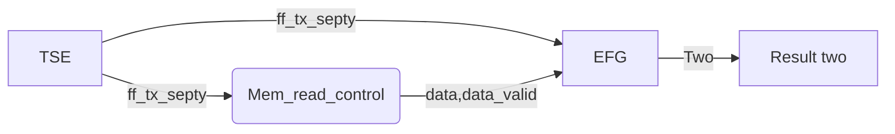

The second layer for KOTO LV2 daq.\
Event building for data from OFC-Layer1.\
Encapusulation inside Ethernet frame.\
Interface between OFC-Layer1 and PC LV3. \
Similar functions (L1A_check, receive_manager, ...) are only kept in KOTO_DAQ_LV2_layer1

